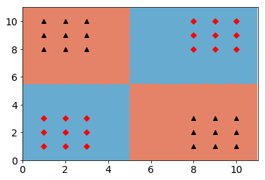
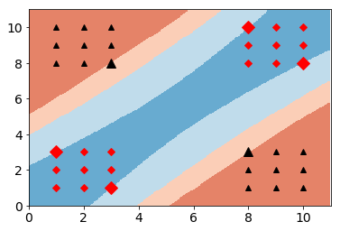
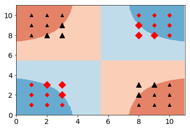

# Kernel Perceptron vs. SVM
Perceptron is one of the earliest algorithms developed for binary classifiers (around 1958!). It is a linear classifier, and so, visually it is represented as a linear boundary. Obviously, a major disadvantage of the perceptron is that it only applies to linearly separable classes. At some later time during the early 1960s, the kernel perceptron was invented for non-linear classifications. Around the same time is also when the Support Vector Machines (SVM) was formulated and it wasn't until much later in 1992 that the kernel trick was formulated that allows SVM to handle non-linear classification problems.

## Description of analysis
This exercise was originally from the *Machine Learning Fundamentals* course from UC San Diego, a course that dives into the theoretical details of several machine learning models.

The exercise contains various two-dimensional datasets which are used to compare the boundaries produced by the perceptron and SVM. The perceptron algorithm was written from the ground up while we use the Sklearn library for SVM. The following shows how the boundaries produced by the perceptron and svm differs from each other.

Perceptron (Kernel: RBF)

SVM (Kernel: quadratic)

SVM (Kernel: RBF)

One advantage of the SVM is that is provides margins of the boundaries, meaning that it helps prevent overfitting of the model. Additionally, the margins here, specifically soft-margins, allow the model to be more generalizable and to have some room for error when applied to new data set. In other words, it allows the model to be more flexible! We can also see that different kernels can have produce different sizes of margins for the classification problem. Although the perceptron algorithm was done from scratch (and I find that to be very involved as it is...) I can imagine coding SVM from the ground up would be even more involved...
